# Deploying containerized application on Azure Kubernetes Services (AKS) using Azure Devops.

**Digram:**

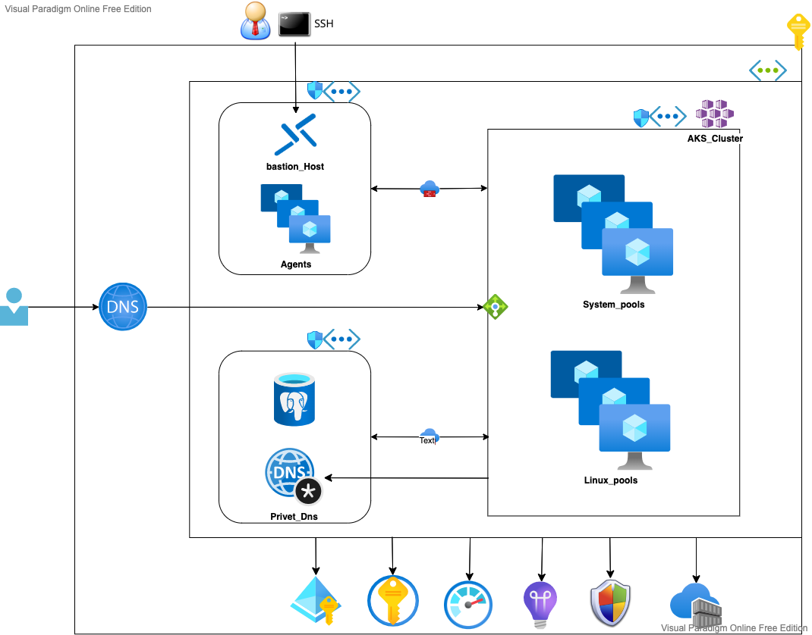

Devops pipline:

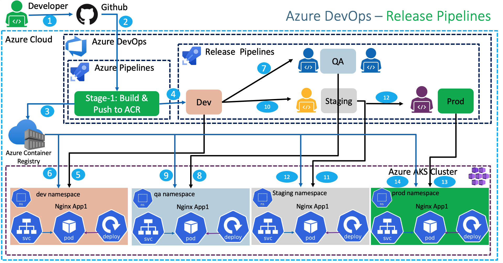

Http ingress roue:

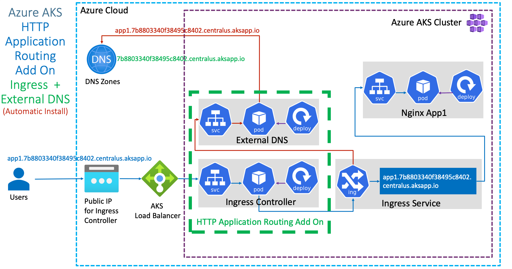

# P0C:
**Resource Manager service connections**

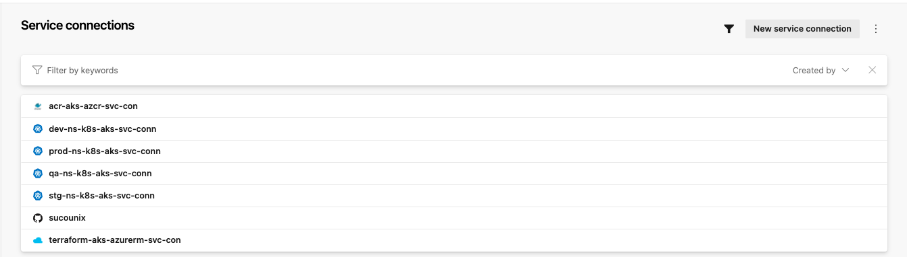

**Slef Hosted Agents (Azure Virtual Machine Scale Sets)**

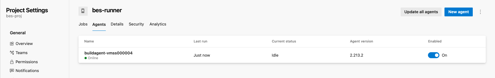

**Azuer Devops Terrafom deploing Pipline**

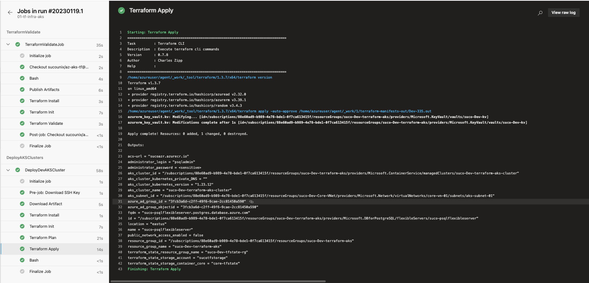

**Azuer Resurses provised using Terrafom azure**

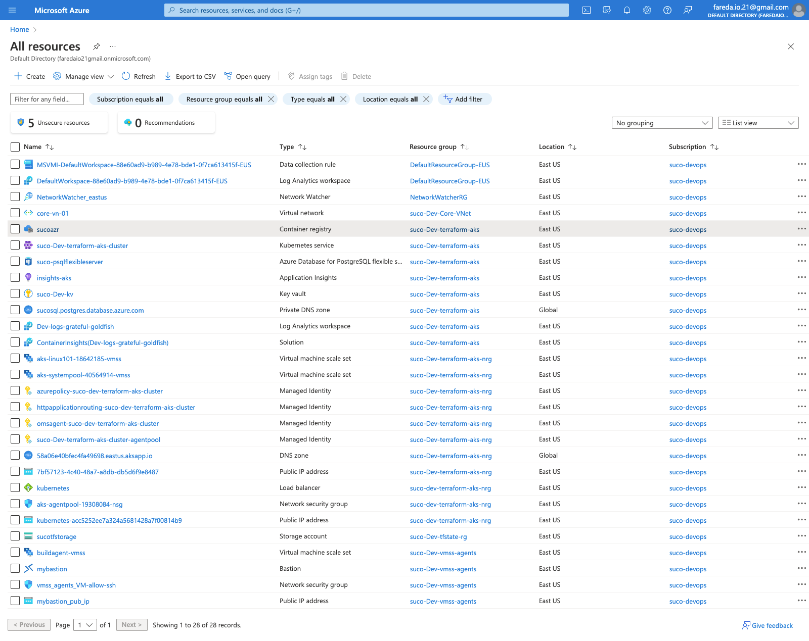

**Azuer Devops APP deploing Pipline**

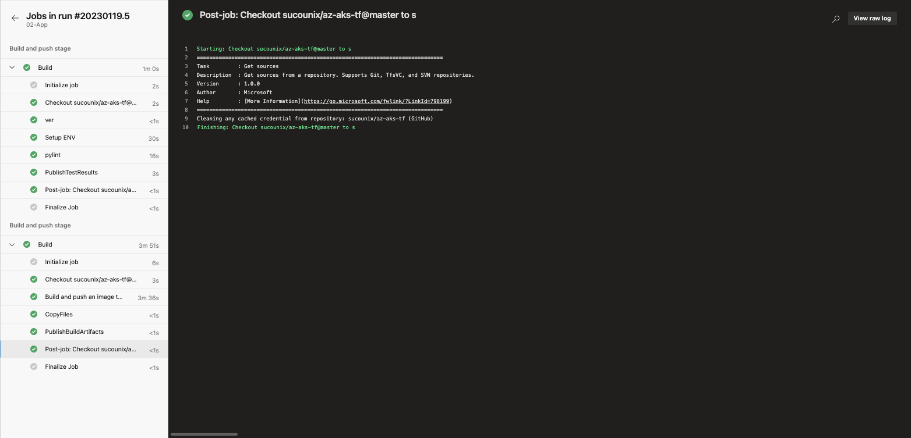

**Azuer Devops APP relase Configration Pipline**

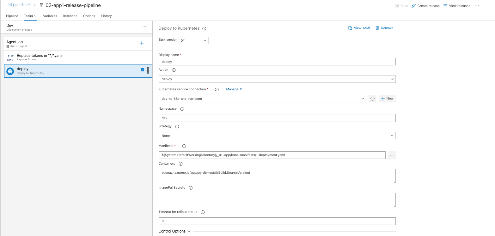

**Azuer Devops APP relase deploing Pipline**

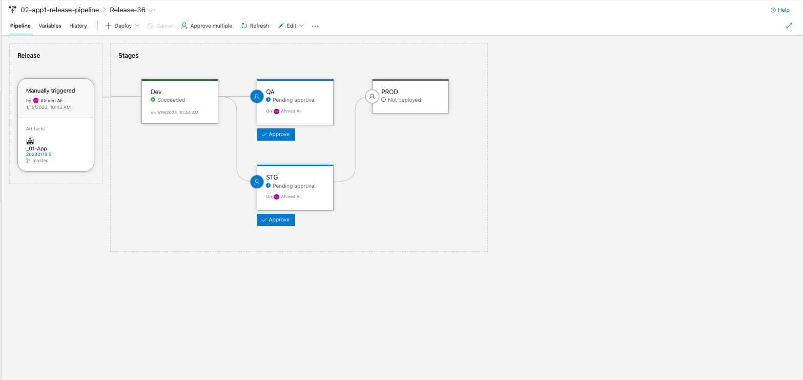

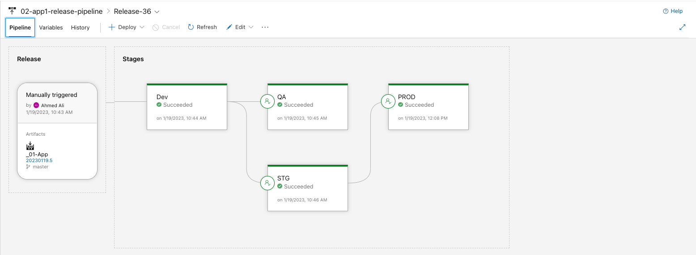

**APP deployment in kubernates and ingress HTTP url**

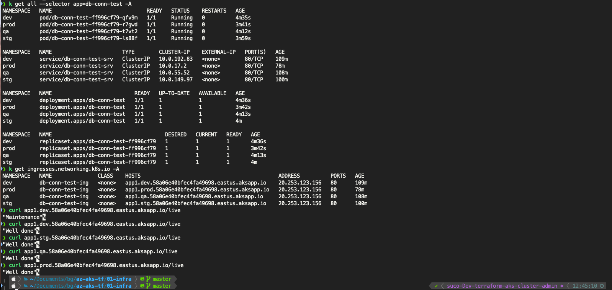

## Thanks for this challenge

